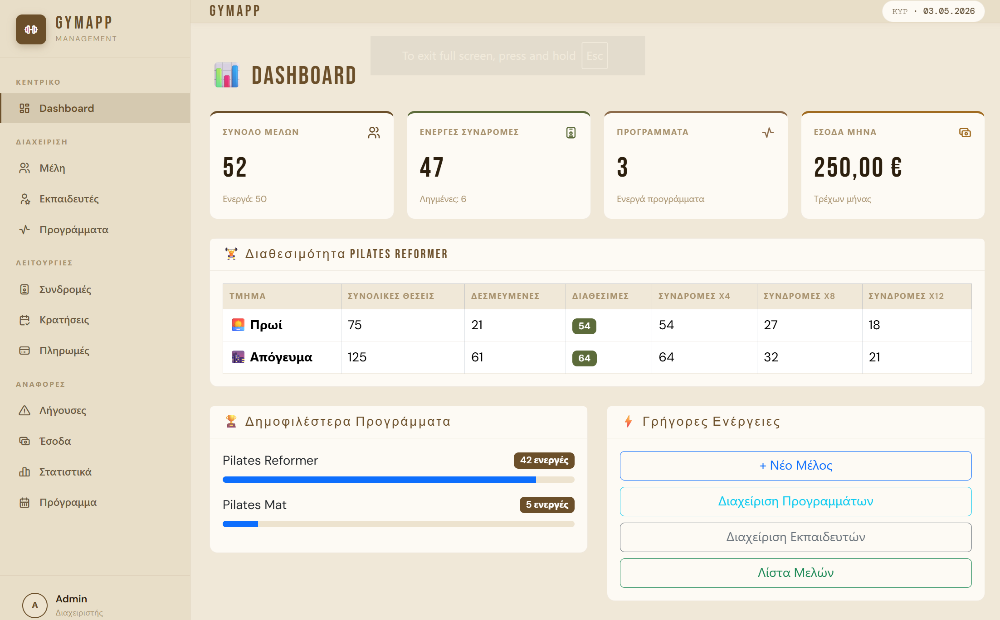
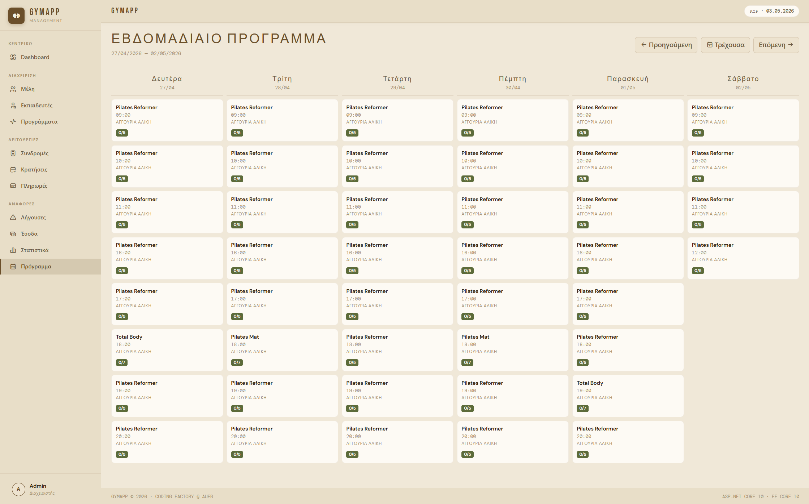
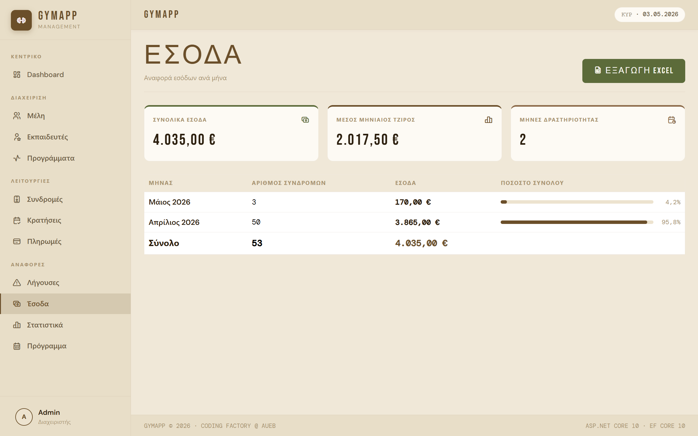
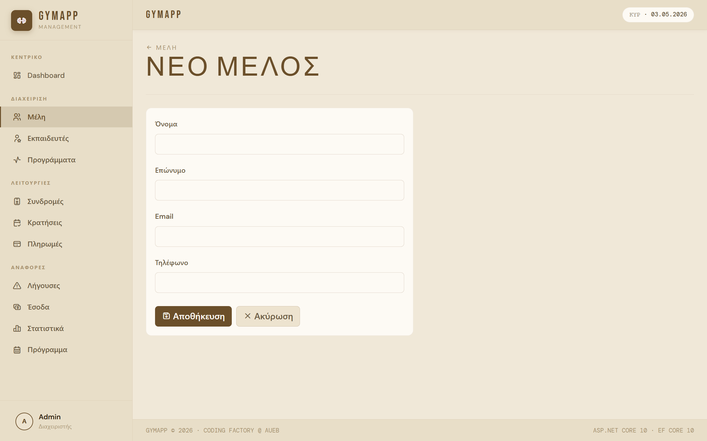

# GymApp 🏋️

Εφαρμογή διαχείρισης γυμναστηρίου χτισμένη με ASP.NET Core Razor Pages.

## Screenshots

### Dashboard


### Εβδομαδιαίο Πρόγραμμα


### Έσοδα


### Νέο Μέλος


## Τεχνολογίες
- ASP.NET Core 10 Razor Pages
- Entity Framework Core 10
- SQL Server Express
- Bootstrap 5
- ClosedXML (Excel export)
- Tabler Icons
- Google Fonts (Bebas Neue, DM Sans, DM Mono)

## Λειτουργίες

### 👤 Διαχείριση Μελών
- CRUD μελών με soft delete
- Αναζήτηση με όνομα, επώνυμο ή τηλέφωνο
- Φιλτράρισμα ενεργών/ανενεργών μελών
- Έλεγχος διπλοεγγραφής email
- Ιστορικό πληρωμών ανά μέλος

### 🏋️ Προγράμματα & Εκπαιδευτές
- CRUD προγραμμάτων και εκπαιδευτών
- Πακέτα συνδρομών (4/8/12 συνεδρίες/μήνα)
- Εβδομαδιαίο πρόγραμμα με διαθέσιμες θέσεις
- Χρωματική ένδειξη πληρότητας slots

### 📋 Συνδρομές
- Εγγραφή μέλους σε πρόγραμμα
- Επιλογή τμήματος (Πρωί/Απόγευμα)
- Έλεγχος διαθέσιμων θέσεων
- Ανανέωση συνδρομής
- Αυτόματη απενεργοποίηση ληγμένων συνδρομών

### 📅 Κρατήσεις
- Σύστημα κρατήσεων ανά slot
- Καταγραφή παρουσίας/No Show/Ακύρωση
- Έλεγχος 24ωρού για ακυρώσεις
- Γρήγορη κράτηση από εβδομαδιαίο πρόγραμμα
- Κάρτα παρουσιών ανά συνδρομή με εκτύπωση

### 💳 Πληρωμές
- Καταγραφή πληρωμών ανά συνδρομή
- Τρόπος πληρωμής (Μετρητά/Κάρτα/Transfer)
- Καταγραφή απόδειξης
- Ιστορικό πληρωμών ανά μέλος
- Συνολική προβολή όλων των πληρωμών

### 📊 Dashboard & Αναφορές
- Dashboard με στατιστικά σε πραγματικό χρόνο
- Διαθεσιμότητα Pilates Reformer (Πρωί/Απόγευμα)
- Ληγούσες συνδρομές (7/14/30 μέρες)
- Αναφορά εσόδων ανά μήνα με Excel export
- Στατιστικά παρουσιών ανά μέλος και πρόγραμμα
- Εβδομαδιαίο πρόγραμμα με κρατήσεις

## Εκκίνηση

### Προαπαιτούμενα
- Visual Studio 2022+
- .NET 10 SDK
- SQL Server Express
- SSMS (προαιρετικό)

### Οδηγίες

1. Clone το repository:
```bash
git clone https://github.com/pvangelatos/GymApp.git
```

2. Άνοιξε το `GymApp.slnx` στο Visual Studio

3. Άλλαξε το connection string στο `appsettings.json`:
```json
{
  "ConnectionStrings": {
    "DefaultConnection": "Server=localhost\\SQLEXPRESS;Database=GymAppDb;Trusted_Connection=True;TrustServerCertificate=True;"
  }
}
```

4. Τρέξε το Migration στο Package Manager Console:
```powershell
Update-Database
```

5. Εκκίνηση με `F5`

## Αρχιτεκτονική

GymApp/
├── Data/               # AppDbContext
├── Models/             # Domain models
├── Pages/              # Razor Pages
│   ├── Members/        # Διαχείριση μελών
│   ├── Trainers/       # Διαχείριση εκπαιδευτών
│   ├── GymPrograms/    # Διαχείριση προγραμμάτων
│   ├── SubscriptionPlans/ # Πακέτα συνδρομών
│   ├── Subscriptions/  # Συνδρομές
│   ├── TimeSlots/      # Εβδομαδιαίο πρόγραμμα
│   ├── Bookings/       # Κρατήσεις
│   ├── Payments/       # Πληρωμές
│   └── Reports/        # Αναφορές
├── Resources/          # Validation messages (el-GR)
├── Services/           # Background services
└── wwwroot/            # Static files (CSS, JS)

## UI Design
- **Theme:** Warm Beige με sidebar navigation
- **Fonts:** Bebas Neue (display), DM Sans (body), DM Mono (mono)
- **Icons:** Tabler Icons
- **Colors:** Warm brown palette με olive και red accents

## Developer
**Παναγιώτης Βαγγελάτος**  
Coding Factory @ AUEB — 2026
